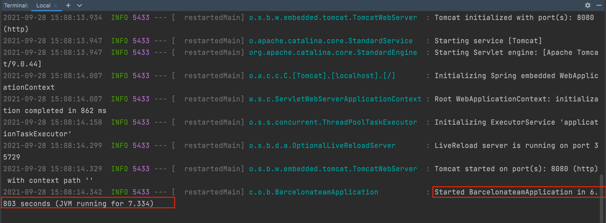

# API Automation Exam
## Server 
- Để start server, chạy câu lệnh trong terminal: mvn spring-boot:run
- Khi thấy log báo `Started BarcelonateamApplication ....` là đã thành công.

## API
   - sử dụng các API trong collection ở file [barcelona_postman_collection.json](barcelona_postman_collection.json)

## Đề thi
- [Exam](exam/exam.md) 
- [API document](exam/rule.md)

- ## Nộp bài
Cách thức nộp bài giống như khi làm bài tập:
- Tạo 1 folder `API-Exam` trên repo cá nhân trong group [Gitlab exercise](https://gitlab.id.vin/qc/training/exercise) và push toàn bộ code project lên đó.